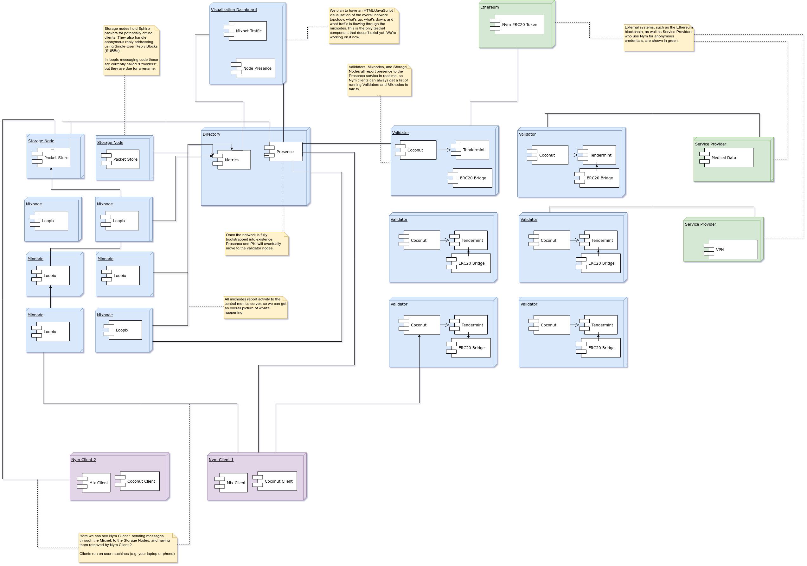

---
# Page settings
layout: default
keywords:
comments: false

# Hero section
title: The Nym Privacy platform
description: Documentation

---

# Introduction

Nym is a blockchain-based privacy platform. It combines network level privacy against sophisticated end-to-end attackers, and an anonymizing layer for transactions using decentralised blinded credentials. Our goal is to allow developers to enable their applications with advanced privacy features unavailable in other systems.

At present, our architecture has three main components: **Validators**, **Mixnodes**, and a **Directory**. All of these are running. The overall picture looks like this:



## Validators

Nym Validators provide privacy-friendly credentials based on the testimony of a set of decentralized, blockchain-based issuing authorities.  You can read an overview of


Status:

## Mixnodes

Loopix is a mixnet, implementing the network anonymity protocol detailed in the [Loopix](https://arxiv.org/abs/1703.00536) and [Sphinx](http://www0.cs.ucl.ac.uk/staff/G.Danezis/papers/sphinx-eprint.pdf) academic papers. It fulfils a similar function to the onion routing in [Tor](https://www.torproject.org/), in that it provides anonymity against attackers who may be monitoring your network traffic or metadata. However, it offers improved protection against adversaries who can monitor the network in its entirety.

Assume a God-like adversary who can watch every packet on the network, record everything, and analyze everything in real-time. Is it possible to have private communications in such an environment? Intuitively, the answer is no: the attacker can watch every request and response, requests and responses, and progressively identify users with a high probability of success.

Loopix solves this problem by *mixing* messages inside network nodes, and adding small random delays to packet transmission. Assume 10,000 messages enter a node during an interval. Each message is then emitted out of order with a small random delay, and sent to another mix node that also has 10,000 messages in it, then to a third mixnode with a further 10,000 messages, and then finally delivered to its destination. Even a God-like attacker will not be able to trace the flow of traffic through the system.

Loopix mitigates against packet-dropping attacks by malicious nodes, and ensures quality-of-service, via *loop* and *cover* traffic, where clients and nodes send messages to themselves to ensure that messages are being delivered properly and that enough messages are going through the system to provide privacy for everyone.

Applications that need to defend against network-level monitoring can use Loopix - private messaging, VPNs, and other applications to enable strong privacy.

A project wanting only private credentials, but no network defences, should be able use Coconut by itself. Conversely, an application that only needs to defend against network attackers can use Loopix by itself, without Coconut. But developers that need end-to-end protection at both the network and transaction level can use both together.

# Building and Running Nym

# Quickstart

## Install and run in Docker

* Install Docker.
* Install Make.
* `rm -rf build` if you've previously installed Nym.
* `git clone` the code.
* `cd nym`
* `make localnet-build` builds the config directories and docker images
* `docker-compose up -d`

All components should now be running (please file a bug report if not).

## Your first Nym request

Go to [TODO Jędrzej please put the URL here], download the sample `nymclient`, and put it somewhere in your `PATH`.

Now run `./nymclient -f localnetdata/localclient/config.toml`.

In the preceding Quickstart, there was a speedy succession of commands to build and run Nym inside docker containers, then hit the containers with the Nym client. If you were able to run all of them without errors, you have made your first Nym request.

But what did all of this do? What are the moving parts of a Nym-based system?

## Building

`make localnet-build` builds out a configuration directory for a Nym testnet that runs on your local machine. Listing the directory structure gives you this layout of files and directories. Use `tree build/` to list the directory tree.

> List the `build` directory using the `tree` command. If you don't have `tree` installed, just poke around using `ls`.

```bash
$ tree build/

build
├── ethereum-watchers
│   ├── watcher1
│   │   ├── config.toml
│   │   └── watcher.key
│   ├── watcher2
│   │   ├── config.toml
│   │   └── watcher.key
│   ├── watcher3
│   │   ├── config.toml
│   │   └── watcher.key
│   └── watcher4
│       ├── config.toml
│       └── watcher.key
├── issuers
│   ├── issuer1
│   │   ├── coconutkeys
│   │   │   ├── threshold-secretKey-id=1-attrs=5-n=5-t=3.pem
│   │   │   └── threshold-verificationKey-id=1-attrs=5-n=5-t=3.pem
│   │   └── config.toml
│   ├── issuer2
│   │   ├── coconutkeys
│   │   │   ├── threshold-secretKey-id=2-attrs=5-n=5-t=3.pem
│   │   │   └── threshold-verificationKey-id=2-attrs=5-n=5-t=3.pem
│   │   └── config.toml
│   └── issuer3
│       ├── coconutkeys
│       │   ├── threshold-secretKey-id=3-attrs=5-n=5-t=3.pem
│       │   └── threshold-verificationKey-id=3-attrs=5-n=5-t=3.pem
│       └── config.toml
├── nodes
│   ├── config
│   │   └── config.toml
│   ├── data
│   ├── node0
│   │   ├── config
│   │   │   ├── config.toml
│   │   │   ├── genesis.json
│   │   │   ├── node_key.json
│   │   │   └── priv_validator_key.json
│   │   └── data
│   │       └── priv_validator_state.json
│   ├── node1
│   │   ├── config
│   │   │   ├── config.toml
│   │   │   ├── genesis.json
│   │   │   ├── node_key.json
│   │   │   └── priv_validator_key.json
│   │   └── data
│   │       └── priv_validator_state.json
│   ├── node2
│   │   ├── config
│   │   │   ├── config.toml
│   │   │   ├── genesis.json
│   │   │   ├── node_key.json
│   │   │   └── priv_validator_key.json
│   │   └── data
│   │       └── priv_validator_state.json
│   └── node3
│       ├── config
│       │   ├── config.toml
│       │   ├── genesis.json
│       │   ├── node_key.json
│       │   └── priv_validator_key.json
│       └── data
│           └── priv_validator_state.json
└── providers
    ├── provider1
    │   ├── accountKey
    │   │   └── provider.key
    │   ├── config.toml
    │   └── issuerKeys
    │       ├── threshold-verificationKey-id=1-attrs=5-n=5-t=3.pem
    │       ├── threshold-verificationKey-id=2-attrs=5-n=5-t=3.pem
    │       ├── threshold-verificationKey-id=3-attrs=5-n=5-t=3.pem
    │       ├── threshold-verificationKey-id=4-attrs=5-n=5-t=3.pem
    │       └── threshold-verificationKey-id=5-attrs=5-n=5-t=3.pem
    └── provider2
        ├── accountKey
        │   └── provider.key
        ├── config.toml
        ├── issuerKeys
        │   ├── threshold-verificationKey-id=1-attrs=5-n=5-t=3.pem
        │   ├── threshold-verificationKey-id=2-attrs=5-n=5-t=3.pem
        │   ├── threshold-verificationKey-id=3-attrs=5-n=5-t=3.pem
        │   ├── threshold-verificationKey-id=4-attrs=5-n=5-t=3.pem
        │   └── threshold-verificationKey-id=5-attrs=5-n=5-t=3.pem
        └── verifier.key
```

As you can see, the config directory contains configuration files,  as well as private and public keys for multiple components.

The components are as follows:

* `ethereum-watchers` watch the Ethereum blockchain for interesting transactions (such as a user piping Nym ERC20 tokens into Nym).
* `issuers` are Coconut credential issuing authorities.
* `nodes` are Tendermint blockchain nodes.
* `verifiers` are Nym credential verifiers validating any credentials service providers want to deposit.
* `providers` are (dummy) external service providers.

## Running Nym in Docker

`docker-compose up -d`

1. starts Ethereum watchers, which point at the Ropsten testnet
1. starts issuing authorities
1. starts Tendermint nodes
1. starts credential verifiers
1. starts dummy service providers

You can get an idea of what infrastructure you're now running by using `docker ps`.

> Truncated output of `docker ps`

```bash
docker ps
IMAGE               COMMAND                  PORTS                                                NAMES
88d0b7d0b4ba        "/app/provider -f /p…"   0.0.0.0:4100->4000/tcp, 0.0.0.0:5100->5000/tcp       provider1
88d0b7d0b4ba        "/app/provider -f /p…"   0.0.0.0:4101->4000/tcp, 0.0.0.0:5101->5000/tcp       provider2
298f6b896c69        "/app/issuer -f /iss…"   0.0.0.0:4000->4000/tcp, 0.0.0.0:5000->5000/tcp       issuer1
298f6b896c69        "/app/issuer -f /iss…"   0.0.0.0:4001->4000/tcp, 0.0.0.0:5001->5000/tcp       issuer2
298f6b896c69        "/app/issuer -f /iss…"   0.0.0.0:4002->4000/tcp, 0.0.0.0:5002->5000/tcp       issuer3
2d9126a7090b        "/app/nymnode"           0.0.0.0:26659->26656/tcp, 0.0.0.0:26660->26657/tcp   node1
2d9126a7090b        "/app/nymnode"           0.0.0.0:26663->26656/tcp, 0.0.0.0:26664->26657/tcp   node3
2d9126a7090b        "/app/nymnode"           0.0.0.0:26656-26657->26656-26657/tcp                 node0
2d9126a7090b        "/app/nymnode"           0.0.0.0:26661->26656/tcp, 0.0.0.0:26662->26657/tcp   node2
```

## Your first Nym credential request

So now all the infrastructure is running. How can you make a request for a credential?

Download and run the Nym sample client. Go to [release page](https://github.com/nymtech/nym/releases/download/v0.9.1/nymclient-linux-x86_64), download the sample `nymclient`, and put it somewhere in your `PATH`. Then run:

`nymclient -f $GOPATH/src/github.com/nymtech/nymlocalnetdata/localclient/config.toml`.

When the client starts running, the following actions occur:

### Initialization

1. the client connects to the Ethereum Ropsten testnet
1. the client connects to the Nym Tendermint blockchain

### Piping currency into Nym

1. the client transfers 1 Nym ERC20 token from its own Ethereum address into the Nym "pipe" account. The "from" account is specified in the file `localnetdata/localclient/clientAccount.key`
1. the Nym Ethereum watcher, meanwhile, has been watching the Ethereum chain for any incoming transactions
1. when a threshold number of Watchers have notified Tendermint that they have seen incoming Nym tokens, the incoming tokens are piped into the Tendermint blockchain for use in the Nym system.
1. the user's account in Nym is credited as having 1 Nym token available.

### Getting partial Nym credentials to spend on a privacy-enabled service

1. the user decides to get a credential for 1 Nym token so that it can be spent.
1. the Nym client generates some cryptographic material, and sends it to the Tendermint chain. The issuers monitor this chain and store partial credentials in their datastores. The client may query for it at any future time to retrieve it. Note: anyone may retrieve any credential, but only the client holding the secret for a given credential may use it.
1. the client queries the issuing authorities and retrieves the each partial credential from as many issuing authorities as desired
1. the client recombines the partial credentials, using a secret key generated specifically for this set of partial credentials

The client has retrieved a partial credential from multiple issuing authorities. At this point, those authorities are still able to identify which client requested the credential, so they could potentially identify the client if it tries to spend the credential. To fix this, the client needs to rerandomize.

### Rerandomizing  and spending the credential

1. the client re-rerandomizes the assembled credential, outputting a fresh credential containing the same cryptographic claims as the original but which is not linked to the original.
1. the user can now spend this new, re-randomized credential with a service provider
1. the user's client sends the credential to a service provider (SP), along with some extra cryptographic material binding the credential to the SP and providing defense against credential replay attacks.

### Validating the credential

Validation of the credential being presented by the user is done by the Service Provider, and the Issuing Authorities (IAs).

1. the SP receives the credential.
1. the SP does local validation of the credential using the verification key of the relevant Issuing Authorities.
1. the SP sends the credential to the Tendermint nodes to redeem it.
1. the Credential Verifiers, meanwhile, monitor this chain and validate credential in redeem requests
1. when a threshold number of Verifiers have notified Tendermint that given credential was valid, the Tendermint nodes redeem the credential, crediting the SP's account with 1 Nym. This is written to the chain to defend against double spending attacks.
1. at this point, the SP has been paid 1 Nym. The user's client is now free to use the service provided by the SP.

## Dummy Service Provider response

In in a production system, Service Providers will be run by third parties. But in order to demonstrate the system, we've built a dummy service provider into a Docker container so that we

1. the SP returns "true" to the client if the redemption request succeeded, and "false" if the redemption request failed.
1. the client receives the response.

## Service logging

There is quite a bit going on in the above flow. To see what happening inside each component when `nymclient` makes its request, you may want to view the logs for each different component.

To get a list of containers, run `docker ps`. Then attach to whichever containers you want to see logs for, e.g:

* `docker attach issuer1`
* `docker attach node0`
* `docker attach provider1`
* `docker attach watcher1`
* `docker attach verifier1`

# Performance testing

## Benchmarks

The benchmarks were performed on 64bit Ubuntu 18.04.1 LTS VM with 2 cores of 3.6GHz Ryzen 1600 assigned. Each individual benchmark was run single-threaded for 1 minute with `-benchtime=60s` flag.

These benchmarks are very old (and partially biased) and require rerunning. They do not represent the current state of the system.


| Operation                        | Times run | Time per op     | Memory per op | Allocs per op     |
|----------------------------------|-----------:|-----------------:|---------------:|-------------------:|
| G1Mul                            | 30000  | 2.41 ms/op   | 0.62 kB/op  | 12416 allocs/op   |
| G2Mul                            | 20000  | 5.87 ms/op   | 1.71 kB/op  | 35368 allocs/op   |
| Pairing                          | 3000   | 24.08 ms/op  | 7.44 kB/op  | 170229 allocs/op  |
| ElGamalEncryption                | 10000  | 7.34 ms/op   | 1.88 kB/op  | 37828 allocs/op   |
| ElGamalDecryption                | 30000  | 2.48 ms/op   | 0.62 kB/op  | 12518 allocs/op   |
|                                  |        |              |             |                   |
| Setup/q=1                        | 100000 | 0.97 ms/op   | 0.08 kB/op  | 1522 allocs/op    |
| Setup/q=3                        | 50000  | 1.44 ms/op   | 0.23 kB/op  | 4204 allocs/op    |
| Setup/q=5                        | 50000  | 2.31 ms/op   | 0.47 kB/op  | 8647 allocs/op    |
| Setup/q=10                       | 20000  | 4.00 ms/op   | 0.91 kB/op  | 16541 allocs/op   |
| Setup/q=20                       | 10000  | 6.59 ms/op   | 1.80 kB/op  | 32650 allocs/op   |
|                                  |        |              |             |                   |
| Keygen/q=1                       | 10000  | 9.53 ms/op   | 3.47 kB/op  | 71764 allocs/op   |
| Keygen/q=3                       | 5000   | 18.83 ms/op  | 6.94 kB/op  | 143543 allocs/op  |
| Keygen/q=5                       | 3000   | 28.53 ms/op  | 10.41 kB/op | 215265 allocs/op  |
| Keygen/q=10                      | 2000   | 50.35 ms/op  | 19.08 kB/op | 394701 allocs/op  |
|                                  |        |              |             |                   |
| TTPKeygen/q=1/t=3/n=5            | 2000   | 51.52 ms/op  | 17.29 kB/op | 357551 allocs/op  |
| TTPKeygen/q=3/t=3/n=5            | 1000   | 94.33 ms/op  | 34.57 kB/op | 715064 allocs/op  |
| TTPKeygen/q=5/t=3/n=5            | 1000   | 141.13 ms/op | 51.86 kB/op | 1072637 allocs/op |
| TTPKeygen/q=10/t=3/n=5           | 300    | 277.17 ms/op | 95.07 kB/op | 1966284 allocs/op |
|                                  |        |              |             |                   |
| TTPKeygen/q=3/t=1/n=5            | 1000   | 105.70 ms/op | 34.30 kB/op | 709764 allocs/op  |
| TTPKeygen/q=3/t=3/n=5            | 1000   | 94.33 ms/op  | 34.57 kB/op | 715064 allocs/op  |
| TTPKeygen/q=3/t=5/n=5            | 1000   | 100.13 ms/op | 34.87 kB/op | 720879 allocs/op  |
|                                  |        |              |             |                   |
| TTPKeygen/q=3/t=1/n=1            | 5000   | 21.91 ms/op  | 6.94 kB/op  | 143605 allocs/op  |
| TTPKeygen/q=3/t=1/n=3            | 2000   | 60.60 ms/op  | 20.62 kB/op | 426695 allocs/op  |
| TTPKeygen/q=3/t=1/n=5            | 1000   | 105.70 ms/op | 34.30 kB/op | 709764 allocs/op  |
| TTPKeygen/q=3/t=1/n=10           | 500    | 188.58 ms/op | 68.51 kB/op | 1417549 allocs/op |
|                                  |        |              |             |                   |
| Sign/pubM=1                      | 30000  | 2.65 ms/op   | 0.71 kB/op  | 14206 allocs/op   |
| Sign/pubM=3                      | 30000  | 2.44 ms/op   | 0.72 kB/op  | 14614 allocs/op   |
| Sign/pubM=5                      | 30000  | 2.46 ms/op   | 0.74 kB/op  | 15029 allocs/op   |
| Sign/pubM=10                     | 30000  | 2.72 ms/op   | 0.77 kB/op  | 16051 allocs/op   |
|                                  |        |              |             |                   |
| PrepareBlindSign/pubM=1/privM=3  | 2000   | 64.42 ms/op  | 18.26 kB/op | 366447 allocs/op  |
| PrepareBlindSign/pubM=3/privM=3  | 1000   | 73.21 ms/op  | 20.79 kB/op | 417517 allocs/op  |
| PrepareBlindSign/pubM=5/privM=3  | 1000   | 82.13 ms/op  | 23.32 kB/op | 468632 allocs/op  |
| PrepareBlindSign/pubM=10/privM=3 | 1000   | 102.95 ms/op | 29.66 kB/op | 596363 allocs/op  |
|                                  |        |              |             |                   |
| PrepareBlindSign/pubM=3/privM=1  | 3000   | 35.50 ms/op  | 10.61 kB/op | 212744 allocs/op  |
| PrepareBlindSign/pubM=3/privM=3  | 1000   | 73.21 ms/op  | 20.79 kB/op | 417517 allocs/op  |
| PrepareBlindSign/pubM=3/privM=5  | 1000   | 109.91 ms/op | 30.96 kB/op | 622296 allocs/op  |
| PrepareBlindSign/pubM=3/privM=10 | 500    | 200.21 ms/op | 56.40 kB/op | 1134289 allocs/op |
|                                  |        |              |             |                   |
| BlindSign/pubM=1/privM=3         | 1000   | 80.25 ms/op  | 19.80 kB/op | 395915 allocs/op  |
| BlindSign/pubM=3/privM=3         | 1000   | 94.95 ms/op  | 23.52 kB/op | 470805 allocs/op  |
| BlindSign/pubM=5/privM=3         | 1000   | 115.88 ms/op | 27.23 kB/op | 545636 allocs/op  |
| BlindSign/pubM=10/privM=3        | 500    | 151.66 ms/op | 36.52 kB/op | 732772 allocs/op  |
|                                  |        |              |             |                   |
| BlindSign/pubM=3/privM=1         | 2000   | 50.99 ms/op  | 13.12 kB/op | 262559 allocs/op  |
| BlindSign/pubM=3/privM=3         | 1000   | 94.95 ms/op  | 23.52 kB/op | 470805 allocs/op  |
| BlindSign/pubM=3/privM=5         | 1000   | 132.86 ms/op | 33.92 kB/op | 679003 allocs/op  |
| BlindSign/pubM=3/privM=10        | 500    | 224.29 ms/op | 59.92 kB/op | 1199647 allocs/op |
|                                  |        |              |             |                   |
| Unblind                          | 50000  | 2.23 ms/op   | 0.62 kB/op  | 12520 allocs/op   |
|                                  |        |              |             |                   |
| Verify/q=1                       | 2000   | 43.74 ms/op  | 16.68 kB/op | 377329 allocs/op  |
| Verify/q=3                       | 2000   | 58.98 ms/op  | 20.13 kB/op | 448605 allocs/op  |
| Verify/q=5                       | 2000   | 72.38 ms/op  | 23.57 kB/op | 519902 allocs/op  |
| Verify/q=10                      | 1000   | 99.86 ms/op  | 32.18 kB/op | 698113 allocs/op  |
|                                  |        |              |             |                   |
| ShowBlindSignature/privM=1       | 3000   | 25.86 ms/op  | 8.30 kB/op  | 170666 allocs/op  |
| ShowBlindSignature/privM=3       | 2000   | 46.45 ms/op  | 15.26 kB/op | 314652 allocs/op  |
| ShowBlindSignature/privM=5       | 2000   | 69.42 ms/op  | 22.22 kB/op | 458565 allocs/op  |
| ShowBlindSignature/privM=10      | 1000   | 122.28 ms/op | 39.63 kB/op | 818530 allocs/op  |
|                                  |        |              |             |                   |
| BlindVerify/pubM=1               | 2000   | 72.81 ms/op  | 25.04 kB/op | 548832 allocs/op  |
| BlindVerify/pubM=3               | 1000   | 95.70 ms/op  | 28.50 kB/op | 620468 allocs/op  |
| BlindVerify/pubM=5               | 1000   | 111.46 ms/op | 31.97 kB/op | 692124 allocs/op  |
| BlindVerify/pubM=10              | 1000   | 149.02 ms/op | 40.63 kB/op | 871100 allocs/op  |
|                                  |        |              |             |                   |
| Make Pi_S/privM=1                | 10000  | 11.69 ms/op  | 3.53 kB/op  | 70166 allocs/op   |
| Make Pi_S/privM=3                | 3000   | 29.47 ms/op  | 8.71 kB/op  | 174317 allocs/op  |
| Make Pi_S/privM=5                | 2000   | 47.39 ms/op  | 13.89 kB/op | 278486 allocs/op  |
| Make Pi_S/privM=10               | 1000   | 91.94 ms/op  | 26.85 kB/op | 538835 allocs/op  |
|                                  |        |              |             |                   |
| Verify Pi_S/privM=1              | 5000   | 19.90 ms/op  | 5.49 kB/op  | 109193 allocs/op  |
| Verify Pi_S/privM=3              | 2000   | 48.99 ms/op  | 13.29 kB/op | 265404 allocs/op  |
| Verify Pi_S/privM=5              | 1000   | 81.02 ms/op  | 21.08 kB/op | 421538 allocs/op  |
| Verify Pi_S/privM=10             | 500    | 157.98 ms/op | 40.58 kB/op | 811975 allocs/op  |
|                                  |        |              |             |                   |
| Make Pi_V/privM=1                | 10000  | 13.29 ms/op  | 4.21 kB/op  | 86467 allocs/op   |
| Make Pi_V/privM=3                | 3000   | 24.83 ms/op  | 7.73 kB/op  | 159146 allocs/op  |
| Make Pi_V/privM=5                | 3000   | 34.45 ms/op  | 11.24 kB/op | 231803 allocs/op  |
| Make Pi_V/privM=10               | 2000   | 62.37 ms/op  | 20.04 kB/op | 413538 allocs/op  |
|                                  |        |              |             |                   |
| Verify Pi_V/privM=1              | 5000   | 26.46 ms/op  | 8.28 kB/op  | 170223 allocs/op  |
| Verify Pi_V/privM=3              | 2000   | 41.59 ms/op  | 11.75 kB/op | 241841 allocs/op  |
| Verify Pi_V/privM=5              | 2000   | 63.44 ms/op  | 15.21 kB/op | 313454 allocs/op  |
| Verify Pi_V/privM=10             | 1000   | 100.71 ms/op | 23.87 kB/op | 492518 allocs/op  |

#### BLS381

| Operation                        | Times run | Time per op     | Memory per op | Allocs per op     |
|----------------------------------|-----------:|-----------------:|---------------:|-------------------:|
| G1Mul                            | 30000 | 3.14 ms/op   | 0.86 kB/op   | 12879 allocs/op   |
| G2Mul                            | 10000 | 7.43 ms/op   | 2.36 kB/op   | 35502 allocs/op   |
| Pairing                          | 2000  | 35.24 ms/op  | 12.98 kB/op  | 227295 allocs/op  |
| ElGamalEncryption                | 10000 | 9.28 ms/op   | 2.62 kB/op   | 39219 allocs/op   |
| ElGamalDecryption                | 30000 | 3.27 ms/op   | 0.87 kB/op   | 12981 allocs/op   |
|                                  |       |              |              |                   |
| Setup/q=1                        | 10000 | 6.20 ms/op   | 0.85 kB/op   | 12359 allocs/op   |
| Setup/q=3                        | 10000 | 10.03 ms/op  | 2.55 kB/op   | 37085 allocs/op   |
| Setup/q=5                        | 5000  | 15.07 ms/op  | 4.23 kB/op   | 61436 allocs/op   |
| Setup/q=10                       | 3000  | 29.58 ms/op  | 8.42 kB/op   | 122373 allocs/op  |
| Setup/q=20                       | 2000  | 58.55 ms/op  | 17.04 kB/op  | 247682 allocs/op  |
|                                  |       |              |              |                   |
| Keygen/q=1                       | 5000  | 14.22 ms/op  | 4.78 kB/op   | 72051 allocs/op   |
| Keygen/q=3                       | 3000  | 29.57 ms/op  | 9.56 kB/op   | 144087 allocs/op  |
| Keygen/q=5                       | 2000  | 43.98 ms/op  | 14.34 kB/op  | 216119 allocs/op  |
| Keygen/q=10                      | 1000  | 79.13 ms/op  | 26.29 kB/op  | 396254 allocs/op  |
|                                  |       |              |              |                   |
| TTPKeygen/q=1/t=3/n=5            | 2000  | 68.68 ms/op  | 24.09 kB/op  | 362908 allocs/op  |
| TTPKeygen/q=3/t=3/n=5            | 500   | 140.11 ms/op | 48.18 kB/op  | 725938 allocs/op  |
| TTPKeygen/q=5/t=3/n=5            | 500   | 250.20 ms/op | 72.26 kB/op  | 1088793 allocs/op |
| TTPKeygen/q=10/t=3/n=5           | 200   | 419.25 ms/op | 132.49 kB/op | 1996312 allocs/op |
|                                  |       |              |              |                   |
| TTPKeygen/q=3/t=1/n=5            | 1000  | 131.74 ms/op | 47.29 kB/op  | 712539 allocs/op  |
| TTPKeygen/q=3/t=3/n=5            | 500   | 140.11 ms/op | 48.18 kB/op  | 725938 allocs/op  |
| TTPKeygen/q=3/t=5/n=5            | 500   | 148.48 ms/op | 49.04 kB/op  | 738884 allocs/op  |
|                                  |       |              |              |                   |
| TTPKeygen/q=3/t=1/n=1            | 3000  | 27.94 ms/op  | 9.57 kB/op   | 144175 allocs/op  |
| TTPKeygen/q=3/t=1/n=3            | 1000  | 80.56 ms/op  | 28.43 kB/op  | 428325 allocs/op  |
| TTPKeygen/q=3/t=1/n=5            | 1000  | 131.74 ms/op | 47.29 kB/op  | 712539 allocs/op  |
| TTPKeygen/q=3/t=1/n=10           | 300   | 264.51 ms/op | 94.44 kB/op  | 1422807 allocs/op |
|                                  |       |              |              |                   |
| Sign/q=1                         | 10000 | 6.59 ms/op   | 1.72 kB/op   | 25457 allocs/op   |
| Sign/q=3                         | 10000 | 6.34 ms/op   | 1.75 kB/op   | 26128 allocs/op   |
| Sign/q=5                         | 10000 | 6.30 ms/op   | 1.77 kB/op   | 26731 allocs/op   |
| Sign/q=10                        | 10000 | 6.85 ms/op   | 1.84 kB/op   | 28319 allocs/op   |
|                                  |       |              |              |                   |
| PrepareBlindSign/pubM=1/privM=3  | 1000  | 99.25 ms/op  | 27.16 kB/op  | 403995 allocs/op  |
| PrepareBlindSign/pubM=3/privM=3  | 1000  | 114.68 ms/op | 30.69 kB/op  | 456865 allocs/op  |
| PrepareBlindSign/pubM=5/privM=3  | 1000  | 125.83 ms/op | 34.23 kB/op  | 509835 allocs/op  |
| PrepareBlindSign/pubM=10/privM=3 | 500   | 155.18 ms/op | 43.07 kB/op  | 642252 allocs/op  |
|                                  |       |              |              |                   |
| PrepareBlindSign/pubM=3/privM=1  | 2000  | 59.54 ms/op  | 16.42 kB/op  | 243791 allocs/op  |
| PrepareBlindSign/pubM=3/privM=3  | 1000  | 114.68 ms/op | 30.69 kB/op  | 456865 allocs/op  |
| PrepareBlindSign/pubM=3/privM=5  | 500   | 159.97 ms/op | 44.96 kB/op  | 669924 allocs/op  |
| PrepareBlindSign/pubM=3/privM=10 | 300   | 279.99 ms/op | 80.66 kB/op  | 1203099 allocs/op |
|                                  |       |              |              |                   |
| BlindSign/pubM=1/privM=3         | 1000  | 116.49 ms/op | 29.71 kB/op  | 439143 allocs/op  |
| BlindSign/pubM=3/privM=3         | 1000  | 137.48 ms/op | 34.89 kB/op  | 516775 allocs/op  |
| BlindSign/pubM=5/privM=3         | 500   | 175.99 ms/op | 40.08 kB/op  | 594434 allocs/op  |
| BlindSign/pubM=10/privM=3        | 500   | 221.57 ms/op | 53.04 kB/op  | 788480 allocs/op  |
|                                  |       |              |              |                   |
| BlindSign/pubM=3/privM=1         | 1000  | 79.49 ms/op  | 20.08 kB/op  | 297298 allocs/op  |
| BlindSign/pubM=3/privM=3         | 1000  | 137.48 ms/op | 34.89 kB/op  | 516775 allocs/op  |
| BlindSign/pubM=3/privM=5         | 500   | 198.60 ms/op | 49.70 kB/op  | 736258 allocs/op  |
| BlindSign/pubM=3/privM=10        | 200   | 360.87 ms/op | 86.72 kB/op  | 1284699 allocs/op |
|                                  |       |              |              |                   |
| Unblind                          | 30000 | 3.29 ms/op   | 0.87 kB/op   | 12981 allocs/op   |
|                                  |       |              |              |                   |
| Verify/q=1                       | 1000  | 79.75 ms/op  | 28.47 kB/op  | 492060 allocs/op  |
| Verify/q=3                       | 1000  | 101.28 ms/op | 33.21 kB/op  | 563590 allocs/op  |
| Verify/q=5                       | 1000  | 121.88 ms/op | 37.96 kB/op  | 635132 allocs/op  |
| Verify/q=10                      | 500   | 157.97 ms/op | 49.83 kB/op  | 813898 allocs/op  |
|                                  |       |              |              |                   |
| ShowBlindSignature/privM=1       | 3000  | 33.87 ms/op  | 11.49 kB/op  | 172584 allocs/op  |
| ShowBlindSignature/privM=3       | 2000  | 68.18 ms/op  | 21.08 kB/op  | 317034 allocs/op  |
| ShowBlindSignature/privM=5       | 1000  | 102.96 ms/op | 30.67 kB/op  | 461511 allocs/op  |
| ShowBlindSignature/privM=10      | 500   | 181.16 ms/op | 54.65 kB/op  | 822574 allocs/op  |
|                                  |       |              |              |                   |
| BlindVerify/pubM=1               | 1000  | 123.31 ms/op | 40.12 kB/op  | 666449 allocs/op  |
| BlindVerify/pubM=3               | 1000  | 139.62 ms/op | 44.89 kB/op  | 738303 allocs/op  |
| BlindVerify/pubM=5               | 500   | 164.23 ms/op | 49.66 kB/op  | 810116 allocs/op  |
| BlindVerify/pubM=10              | 500   | 229.97 ms/op | 61.60 kB/op  | 989803 allocs/op  |
|                                  |       |              |              |                   |
| ConstructSignerProof/privM=1     | 5000  | 19.20 ms/op  | 5.78 kB/op   | 85033 allocs/op   |
| ConstructSignerProof/privM=3     | 2000  | 43.65 ms/op  | 13.08 kB/op  | 193845 allocs/op  |
| ConstructSignerProof/privM=5     | 1000  | 67.95 ms/op  | 20.39 kB/op  | 302659 allocs/op  |
| ConstructSignerProof/privM=10    | 1000  | 129.18 ms/op | 38.65 kB/op  | 574694 allocs/op  |
|                                  |       |              |              |                   |
| VerifySignerProof/privM=1        | 3000  | 28.52 ms/op  | 8.63 kB/op   | 126866 allocs/op  |
| VerifySignerProof/privM=3        | 2000  | 67.80 ms/op  | 19.74 kB/op  | 291483 allocs/op  |
| VerifySignerProof/privM=5        | 1000  | 112.43 ms/op | 30.85 kB/op  | 456039 allocs/op  |
| VerifySignerProof/privM=10       | 500   | 215.14 ms/op | 58.63 kB/op  | 867673 allocs/op  |
|                                  |       |              |              |                   |
| ConstructVerifierProof/privM=1   | 5000  | 21.35 ms/op  | 5.85 kB/op   | 87663 allocs/op   |
| ConstructVerifierProof/privM=3   | 2000  | 41.01 ms/op  | 10.69 kB/op  | 160576 allocs/op  |
| ConstructVerifierProof/privM=5   | 2000  | 59.72 ms/op  | 15.54 kB/op  | 233515 allocs/op  |
|                                  |       |              |              |                   |
| ConstructVerifierProof/privM=10  | 1000  | 115.53 ms/op | 27.64 kB/op  | 415779 allocs/op  |
| VerifyVerifierProof/privM=1      | 2000  | 52.42 ms/op  | 11.51 kB/op  | 172606 allocs/op  |
| VerifyVerifierProof/privM=3      | 1000  | 77.37 ms/op  | 16.29 kB/op  | 244440 allocs/op  |
| VerifyVerifierProof/privM=5      | 1000  | 103.73 ms/op | 21.06 kB/op  | 316318 allocs/op  |
| VerifyVerifierProof/privM=10     | 500   | 169.76 ms/op | 32.99 kB/op  | 495936 allocs/op  |


# Developer documentation

## Pre-requisites

To run the code, follow the standard Go installation procedure as described in [https://golang.org/doc/install](https://golang.org/doc/install).

All of the required dependencies are attached in the vendor directory.

## Test

In order to run tests, simply use the following:

`go test -v ./...`
